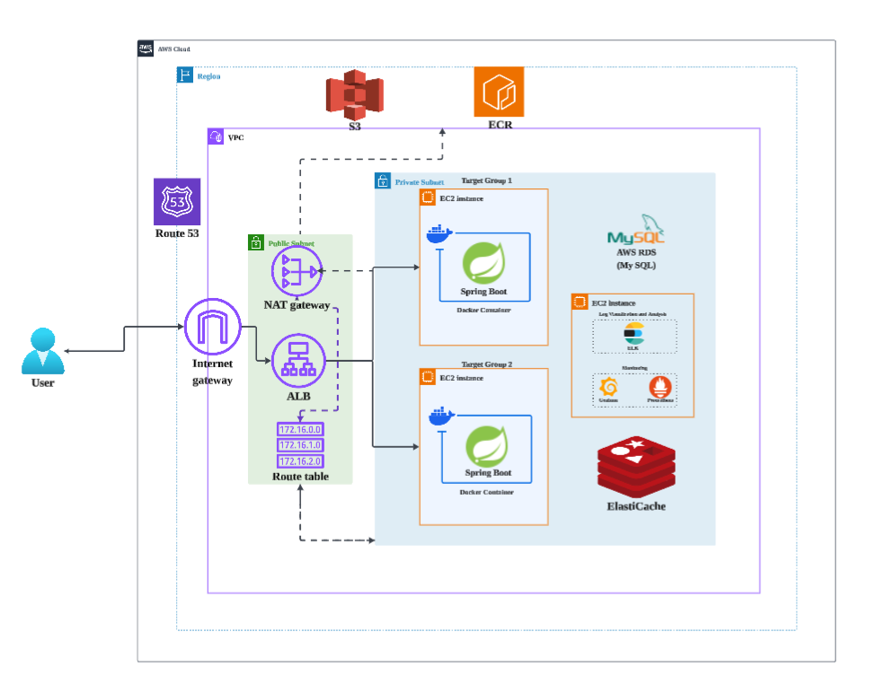
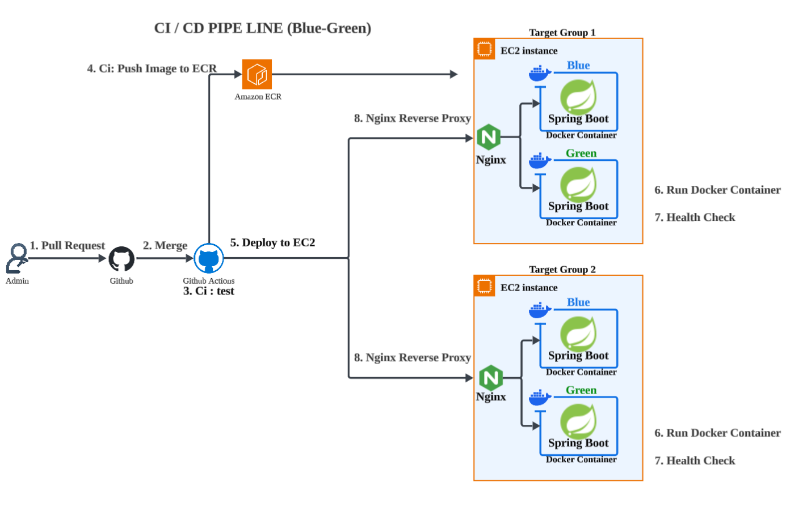
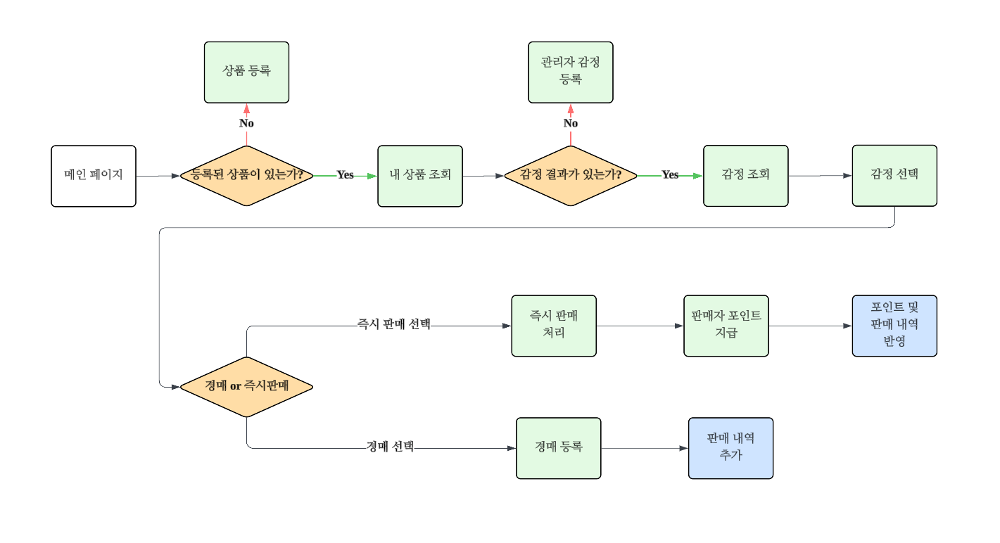
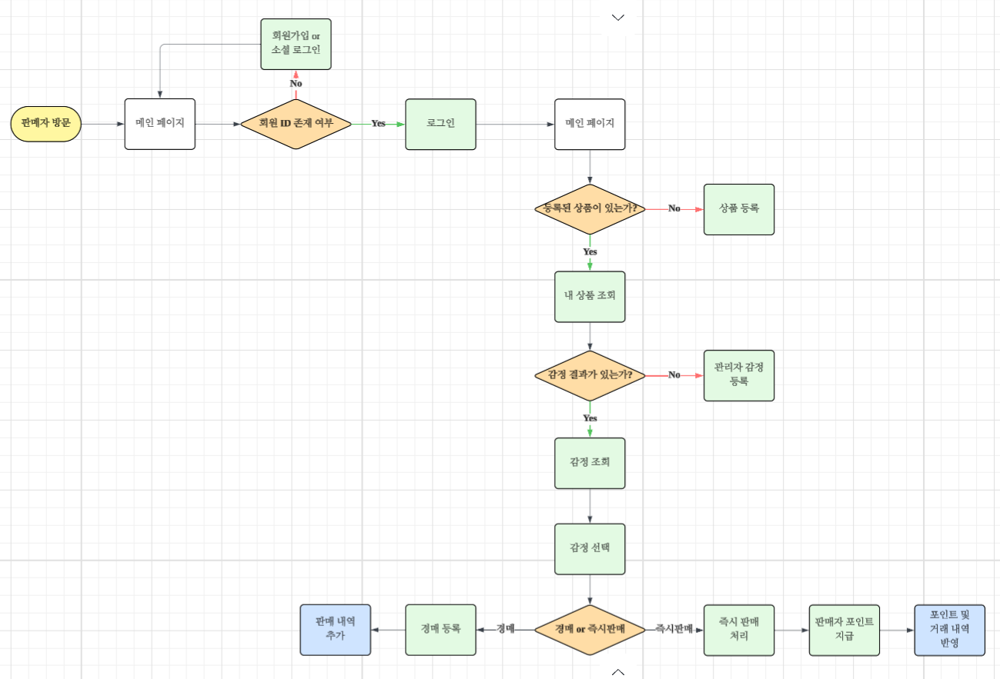

#  Quick-Sells : 온라인 전당포 플랫폼

  
   

## 목차
1. [프로젝트 개요](#1-프로젝트-개요)
2. [기술적 개요](#2-기술적-개요)
3. [서비스 흐름](#3-서비스-흐름)
4. [기술적 도전과 해결](#4-기술적-도전과-해결)
5. [로드맵](#5-로드맵)
6. [문의처](#6-문의처)
7. [팀원 소개 및 소감](#7-팀원-소개-및-소감)

---

## [1] 프로젝트 개요

**Quick-Sells**는 급전이 필요한 사용자가 자신의 물건을 담보로 맡기거나 즉시 판매할 수 있는 **온라인 전당포 & 실시간 경매 플랫폼**입니다. 기존 중고거래의 느린 판매 속도와 전당포의 접근성 문제를 해결하기 위해, 감정사 감정가 제안과 실시간 경매 시스템을 결합하여 가치 있는 물건을 가장 빠르고 합리적인 가격에 현금화할 수 있는 서비스를 지향합니다.

### 🎯 기획 의도 및 목표
* **빠른 현금화:** 감정 후 즉시 판매 시스템을 통해 최적의 가격으로 즉시 거래 성사
* **신뢰 기반 거래:** 투명한 감정 체계와 안전 결제 시스템을 통한 온라인 전당포 기능 구현
* **사용자 편의성:** 번거로운 등록 과정을 최소화하고 직관적인 입찰 경험 제공

### ✨ 주요 핵심 기능
* **실시간 역경매 & 경매:** 구매자들 간의 경쟁을 통해 상품의 가치를 극대화하는 실시간 입찰 시스템
* **감정사 시세 감정:** 이미지 분석을 통해 물건의 상태를 파악하고 적정 시작가  산출
* **안전 결제 연동:** 토스페이먼츠 등 간편 결제를 통한 신뢰도 높은 거래 환경 조성

---

## [2] 기술적 개요

### 핵심 기술 스택 (Tech Stack)

  
  
  
  
  
  

### 상세 기술 명세 (Detailed Stack)

| 분류 | 기술 이름 |
| :--- | :--- |
| **Language & IDE** | Java 17, IntelliJ IDEA |
| **Database** | MySQL, Redis |
| **Framework & Library** | Spring Boot, Spring Data JPA, Spring WebClient, QueryDSL, Lombok |
| **Security & Payment** | JWT, Spring Security, OpenAPI, Toss Payments, Google OAuth 2.0 |
| **Infra (AWS)** | EC2, ECR, RDS, S3, ALB, NAT Gateway, Internet Gateway, IAM, Route 53 |
| **Monitoring & Log** | Prometheus, Grafana, ELK Stack (Elasticsearch, Logstash, Kibana), Filebeat |
| **CI/CD & Test** | Docker, GitHub Actions, JUnit5, Mockito, RESTDocs, Postman, Swagger |
| **Design & Collab** | ERD Cloud, Figma, draw.io, Lucidchart, Excalidraw, Slack, Notion, Zep |

### 시스템 아키텍처 (System Architecture)
> 전체적인 클라우드 인프라와 서비스 구성도입니다.

* **AWS 클라우드 환경:** ALB를 통한 부하 분산 및 퍼블릭/프라이빗 서브넷 분리로 보안 강화
* **데이터 관리:** MySQL(Main DB)과 Redis(Cache/Session)의 역할 분담

### CI/CD 파이프라인 (Deployment)
> GitHub Actions와 Docker를 이용한 자동화 배포 구조입니다.

* **자동화 프로세스:** 코드 Push 시 테스트 → 빌드 → Docker Image 생성 → ECR 업로드 → EC2 배포 완료
* **모니터링:** ELK 그리고 Prometheus와 Grafana를 연동하여 서버 상태 실시간 관제

---

## [3] 서비스 흐름
> 사용자의 서비스 진입부터 경매 낙찰 및 거래 완료까지의 전체 프로세스입니다.
### 구매자 flow 차트

### 판매자 flow 차트

### 🔄 주요 프로세스 요약
* **회원가입 및 인증:** 일반/소셜 로그인을 통한 서비스 진입 및 권한 관리
* **상품 등록 및 감정:** 감정 신청을 통한 물건 가치 산정 (관리자/감정가 개입)
* **경매 및 입찰:** 포인트 충전 후 실시간 경매 입찰 참여 및 낙찰 프로세스
* **거래 및 채팅:** 낙찰 성공 시 구매자와 판매자 간 1:1 채팅을 통한 최종 거래 완료
* **마이페이지:** 내 관심 목록, 경매 내역, 포인트 입출금 관리

---

## [4] 기술적 도전과 해결

> 프로젝트 개발 과정에서 직면한 문제와 해결 과정을 정리했습니다.  
> 각 항목을 클릭하면 상세 문서를 확인할 수 있습니다.

### 1️⃣ 기술적 의사결정 (Technical Decisions)

> 특정 기술을 선택한 이유와 대안 비교, 설계 고민을 정리했습니다.

- ⚖️ [**PointWallet 낙관적 락(Optimistic Lock) 도입 결정**](https://github.com/Tior931108/QuickSells/blob/feat/readme-cjh/docs/tech_decision_wallet_optimistic_lock.md)

- ⚖️ [**실시간 채팅 시스템 WebSocket STOMP 도입**](https://github.com/Tior931108/QuickSells/blob/feat/readme-cjh/docs/tech_decision_websocket_stomp.md)

---

### 2️⃣ 성능 개선 (Performance Tuning)

> 조회 성능, 응답 속도, 쿼리 최적화를 통해 사용자 경험을 개선한 사례입니다.

- 🚀 [**QueryDSL Fetch Join을 통한 N+1 문제 해결 및 조회 성능 20배 개선**](https://github.com/Tior931108/QuickSells/blob/feat/readme-cjh/docs/querydsl_performance_improvement.md)

- 🚀 [**채팅방 조회 및 메시지 전송 시 N+1 쿼리 문제 최적화**](https://github.com/Tior931108/QuickSells/blob/feat/readme-cjh/docs/chat_performance_optimization.md)

- 🚀 [**Redis 기반 상품 검색어 중복 카운트 방지**](https://github.com/Tior931108/QuickSells/blob/feat/readme-cjh/docs/redis_search_deduplication.md)

- 🚀 [**결제 승인 멱등성 보장으로 중복 적립 방지**](https://github.com/Tior931108/QuickSells/blob/feat/readme-cjh/docs/payment_idempotency_protection.md)

---

### 3️⃣ 트러블슈팅 (Troubleshooting)

> 개발 및 운영 중 발생한 실제 장애 해결 사례입니다.

- ✅️ [**경매 입찰 동시성 제어를 위한 Lock 설계**](https://github.com/Tior931108/QuickSells/blob/feat/readme-cjh/docs/concurrency_control_redisson_lock.md)

---

## [5] 로드맵
💡 **Quick-Sells**의 현재 진행 상황과 향후 업데이트 계획입니다.

| 마일스톤                 | 예정 일정    | 상세 내용                          | 상태 |
|:---------------------|:---------|:-------------------------------| :--- |
| **V4.0.0 (Payment)** | 2026년 4월 | 경매 입찰시 포인트 hold 기능 및 환불 서비스 도입 | 📅 예정 |
| **v4.0.0 (Search)**  | 2026년 4월 | 경매 서비스 검색 시 랭킹 제도 도입           | 📅 예정 |
| **v4.1.0 (Auction)** | 2026년 6월 | 실시간 경매 입찰 전광판 비동기 서비스 처리 도입    | 📅 예정 |
| **v4.1.1 (Service)** | 2026년 8월 | Quick-sells 택배 시스템 도입          | 📅 예정 |

---

## [6] 문의처
📧 **이메일:** fluxing@naver.com

프로젝트 검토 중 궁금한 점이 있으시면 위 이메일로 연락 부탁드립니다. 최대한 빠르게 답변해 드리겠습니다!

---

## [7] 팀원 소개 및 소감

|  |  |  |  |  |
|:-------------------------------------------------:|:-------------------------------------------------:|:-------------------------------------------------:|:-------------------------------------------------:|:-------------------------------------------------:|
|                      **정용준**                      |                      **이용준**                      |                      **고아람**                      |                      **이청운**                      |                      **최정혁**                      |
|    [Tior931108](https://github.com/Tior931108)    |      [d0ngx2-2](https://github.com/d0ngx2-2)      |      [aram0117](https://github.com/aram0117)      |  [Leechungwoon](https://github.com/Leechungwoon)  | [jhyeok-design](https://github.com/jhyeok-design) |
|                    "행복한 프로젝트"                     |                    "운동 많이 된다."                    |                     "행복했습니다."                     |                    "행복은 4인부터"                     |                   "우리팀 리멤버"                   |

