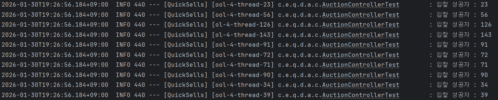
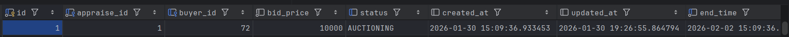
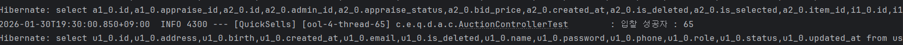
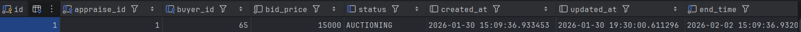
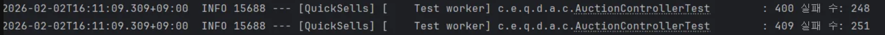

- **🔒경매 입찰 동시성 제어를 위한 락(Lock) 설계**

---

### 🧐문제 정의

- 경매 서비스 특성상 인기 경매 상품은 마감 시간전 입찰 요청에 동시성이 발생할 것으로 보이는 것으로 확인되었습니다.

- 특히 마감 직전 특정 인기 상품에 입찰이 집중되며 동일 시점에 다수의 사용자가 동시에 입찰을 시도하는 상황이 발생할 수 있습니다.
- 이 경우 다음과 같은 문제가 발생할 수 있습니다:
    - 동일 금액이 동시에 저장되는 정합성 오류
    - 더 낮은 금액이 더 높은 금액을 덮어쓰는 Lost Update 문제
    - 분산 서버 환경에서 인스턴스 간 동시성 제어 불가
    - 입찰 순서가 보장되지 않아 공정성 문제 발생

> 경매 시스템에서 동시성 문제는 단순 오류가 아니라  
> 거래 신뢰도에 직접적인 영향을 주는 핵심 안정성 문제였습니다.

---

### 📜 해결 방안

- <대안 1> 비관적 락
    - 장점
        - db에 락을 걸어 동시성 이슈 발생 시 데이터 정합성을 유지시켜주는 장점을 가지고 있습니다
    - 단점
        - 비관락은 경매 입찰 로직외에 조회 로직에도 락이 걸려 조회 성능을 낮추는 결과를 낳을수 있고 서로 자원을 점유하려는 쓰레드들이 많아지면 데드락이 발생할 수 있습니다.

- <대안 2> 낙관적 락
    - 장점
        - 비관 락처럼 db에 락을 거는것이 아닌 엔티티에 버전을 만들어 동시성 발생 시 버전 확인을 통해 관리하므로 데이터 정합성도 지키면서 데드락 발생률이 낮아 안정적인 서버관리가 가능합니다.
    - 단점
        - 한정판이나 가치가 높은 상품일수록 경매가 치열하여 동시성 이슈가 발생할 가능성이 높기 때문에 때에 따라서는 비관적으로 볼 수 있는 상황이 발생할 수 있습니다.

- <대안 3> 분산 락 (Redis - Redisson Lock)
    - 장점
        - 분산 환경에서의 쓰레드를 처리하는데 효율적입니다.
        - 락 주인만 락을 해제 하는 흐름을 구현 하여 일관성을 유지하는 장점을 가진 루아스크립트 기능을 탑재하고 있고 와치독 같은 ttl 만료시 자동 연장시켜 동시성이 발생할 수 있는 부분을 방지해주는 기능 등을 설정 할 수있는 장점을 가지고 있습니다.
        - 순차적 락 획득을 보장해주는 PairLock, 여러 개의 락을 하나의 그룹으로 묶어 관리하는 MultiLock 등 여러 종류의 Lock을 지원합니다.
    - 단점
        - 단일 환경에서는 비관락과 낙관락으로도 충분한 상황에서 분산락 적용은 굳이 안해도 되는 Redis 서버를 관리 해야하고 유지비용 측면에서도 비효율적입니다.

---

### ✏️해결 과정

- 서비스 규모가 커짐과 동시에 분산 서버를 운영하는 상황 (확장성)을 고려하여 분산 환경에서 동시성을 제어하는데 효과적인 분산락을 필요한 트랜잭션에만 적용하기 위해 aop와 커스텀 어노테이션으로 입찰 로직에만 분산락을 적용하였습니다.
- 테스트를 통해 한번에 많은 트래픽을 날려 경매 입찰 기능에 동시 요청이 들어올 때의 상황을 테스트 코드의 로그와 JMeter 테스트 프로그램 등을 활용하여 동시성을 제어하는 흐름을 검증하였습니다.

---

### 📌 해결

하나의 요청이 먼저 락을 걸고 나머지 요청은 대기 상태에 진입하거나, 대기 시간이 지나서 락을 걸지 못한 나머지 요청에게 예외를 발생시켜 접근을 막는 흐름을 검증하였습니다.

#### 1. 분산 락 적용 전 (500명 동시 요청 테스트)
* **로그(Log)**: 여러 쓰레드가 동시에 데이터를 읽고 수정하여 정합성이 깨지는 모습 확인
  ![분산락 적용 전 로그]
* **DB 상태**: 동일한 입찰가나 잘못된 순환 데이터가 저장된 결과
  ![분산락 적용 전 DB 상태]

#### 2. 분산 락 적용 후 (500명 동시 요청 테스트)
* **로그(Log)**: 락을 획득한 쓰레드만 순차적으로 로직을 수행하는 흐름 확인
  ![분산락 적용 후 로그]
* **DB 상태**: 최종적으로 가장 높은 입찰가 하나만 정확하게 반영된 결과
  ![분산락 적용 후 DB 상태]

#### 3. 예외 처리 확인
* **상태 코드**: 400(현재가보다 낮은 금액 유효성 검증 예외), 409(대기 시간 만료 후 락 획득 실패 예외)가 명확하게 구분되어 발생
  ![예외 처리 결과]

---

### 📝회고록

#### 배운 점

- 단일 서버 환경과 분산 서버 환경에서의 동시성 제어 방식은 근본적으로 다르다는 점을 체감하였습니다.
- DB 레벨 Lock만으로는 수평 확장 환경에서 완전한 제어가 어렵다는 점을 이해하게 되었습니다.
- Redisson의 Watchdog 기능과 Lua Script 기반 unlock 방식이 왜 필요한지 테스트를 통해 확인하였습니다.
- 락을 무조건 거는 것이 아니라, 필요한 트랜잭션에만 최소 범위로 적용하는 설계가 중요하다는 점을 학습하였습니다.

#### 적용 결과

- 500명 동시 요청 테스트에서도 입찰 금액 역전 현상 미발생
- 순차적 입찰 처리 보장
- 락 획득 실패 요청은 409 예외로 명확히 구분하여 응답
- 분산 환경에서도 동일한 동시성 제어 구조 유지 가능

#### 개선 가능한 부분

- Redis Cluster 환경으로 확장 고려
- 락 대기 시간 및 재시도 전략 세밀한 튜닝 필요
- 초고빈도 경매 상품에 대해서는 메시지 큐(Kafka 등) 기반 처리 모델 검토 가능
- 락 충돌률 및 대기시간 모니터링 지표화 필요

---

> “동시에 요청이 들어와도 결과는 항상 하나로 수렴한다.”  
> 경매 시스템의 신뢰성을 확보하기 위해 분산 락 기반 동시성 제어를 설계하였습니다.
