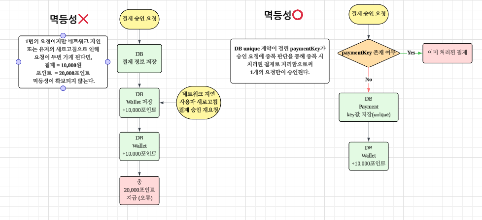

- **🚨 결제 승인 멱등성 보장으로 중복 적립 방지**

---

### 🧐문제 상황

> 결제 시스템에서는 네트워크 장애나 사용자 재요청으로 인해  
> **동일한 결제 승인 요청이 여러 번 들어올 수 있습니다.**

- 사용자가 결제 완료 후 새로고침
- PG사(Toss) 응답 지연
- 클라이언트 재요청
- 결제 콜백 중복 전달

> 금전 데이터 특성상 이는 단순 버그가 아니라 **재무 사고 수준의 리스크**이기 때문에 반드시 방지해야 했습니다.

---

### 📜해결 방안

### 대안 1) 멱등성 미구현 (단순 처리)

- ✅ 구현 빠름
- ❌ 중복 호출 시 중복 적립 발생 → **재무 사고 발생**
- ❌ 장애 상황에서 복구/추적 어려움

➡️ **금전 데이터 특성상 선택 불가**

---

### 대안 2) 프론트에서 중복 클릭/재요청 차단

- ✅ UX 관점에서 일부 중복 줄일 수 있음
- ❌ 네트워크 재시도 / 콜백 중복 등 서버 밖에서 발생하는 중복은 막을 수 없음
- ❌ 서버가 멱등하지 않으면 결국 사고 가능

➡️ **보조 수단일 뿐, 서버 멱등성을 대체할 수 없음**

---

### 대안 3) 단순 `existsByPaymentKey()` 선검증만 사용

- ✅ 구현 쉬움, 빠른 차단 가능
- ❌ **TOCTOU 레이스 존재**
    - (exists 확인 후 insert 사이에 다른 요청이 들어오면 둘 다 통과 가능)

➡️ DB 레벨 최종 방어가 없으면 불완전

---

### 대안 4) DB Unique 제약만 사용 (payment_key UNIQUE)

- ✅ **최종 중복을 DB가 막아줌 → 강력한 정합성**
- ❌ 중복 요청이 많을수록 DB 예외가 빈번히 발생 → 로그/예외 비용 증가
- ❌ 예외 기반 흐름만으로는 “이미 처리된 결제”를 깔끔히 응답하기 어려움

➡️ 정합성은 좋지만 운영/응답 설계가 다소 거칠어짐

---

### 대안 5) 선검증 + DB Unique 이중방어 (채택) ✅

- ✅ 선검증으로 불필요한 **DB 충돌**을 줄임
- ✅ Unique로 **최종 정합성**을 DB에서 보장
- ✅ 동시에 들어오는 요청에도 “중복 적립”이 불가능
- ✅ 운영 관점에서는 중복 요청을 “정상적인 시나리오”로 처리 가능

➡️ **정합성 + 운영성 + 안정적인 응답**을 모두 확보

---

### 📌해결과정

✅ **paymentKey / orderId 기반 중복 검증**

- 이미 승인된 결제인지 DB에서 선검증
- 존재하면 추가 처리 없이 즉시 종료

✅ **Unique 제약 조건 활용**

- paymentKey에 유니크 제약 적용
- DB 레벨에서도 중복 저장 차단

> **“같은 결제는 단 한 번만 처리한다”**  
> 는 원칙을 기반으로 결제 승인 로직에 멱등성을 적용했습니다.

---

### 📌결과

### 결제 승인 프로세스


1️⃣ Toss 결제 승인 요청 수신

2️⃣ paymentKey로 **기존 결제 존재 여부 조회**

3️⃣ 존재하면 → 중복 요청으로 판단하고 종료

4️⃣ 최초 요청이면 → 승인 처리 + 포인트 적립 + 거래 기록 생성

```javascript
if(paymentRepository.existsByPaymentKey(paymentKey)){
    return; // 이미 처리된 결제
}
```


- ✅ 포인트 중복 지급 차단
- ✅ 장애 상황에서도 데이터 정합성 유지
- ✅ 운영 리스크 감소
- ✅ 재시도 가능한 안정적인 결제 구조

> **“실패해도 다시 호출하면 된다”**  
> 는 안정적인 시스템 설계가 가능해졌습니다.

