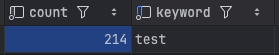
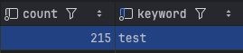
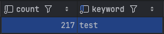
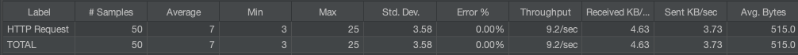
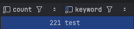
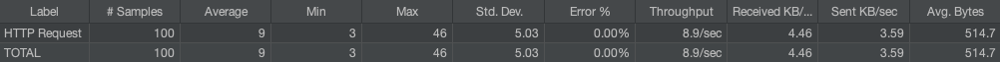

# 🚨 Redis 기반 상품 검색어 중복 카운트 방지

### 🛠️ 문제 상황 및 원인
검색 기능 특성상 동일 사용자가 검색어를 짧은 시간에 반복 호출 하는 경우 발생하는 문제가 발생
* 검색어 조회수가 조회마다 증사하며 인기 검색어 부분에서 순위 오류 발생 가능
* 짧은 시간에 카운트 증가는 불필요한 부하 발생
* 어뷰징 트래픽에 취약
* 조회수 올라가는 기능에 제한이 필요하다고 판단하였습니다.

---

### 📌 해결 과정
Redis의 카운트 기능을 활용해 동일 사용자가 동일 상품을 조회할 경우 짧은 시간에 중복 카운트를 차단하는 구조를 적용했습니다.
* 최초 요청만 조회수 증가
* 이후 중복으로 클릭시 일정 시간 동안 동일 요청은 조회수 증가 안됨
* 일정 시간 만료 후 다시 1회 조회수 증가

#### 구현 방식: Redis SET NX + TTL 사용
* **유저ID + 검색어** 기준으로 Redis키 생성
* **SET NX**: 키가 없을 때 값을 저장하며, 이미 있는 경우 작동 안한다.
* **TTL**: 키가 정해진 시간 후 자동 삭제되는 기능
* **TTL 3초 설정**: 3초 동안은 재요청하면 조회수 증가 안됨
* **키 설정 예시**: `search:click:dedup:{userId}:{keyword}`

---

### 🧪 검증 테스트
Redis 기반 검색어 중복 방지 기능이 TTL기준으로 동작하는지 검증

#### 테스트 조건
* **동일 사용자 / 동일 검색어 / 짧은 시간 반복 요청**
* **TTL 3초** 기준으로 중복 방지 확인 여부
* **테스트 도구**: JMeter
* **요청 방식**: 반복 요청 (간격 100ms)
* **요청 횟수**: 20 / 50 / 100 회

#### 테스트 시나리오
1. 사용자가 검색어 요청
2. 서버에서 Redis 중복 방지하는 키 존재 여부 확인
3. 키가 없는 경우: 검색어 카운트 증가 + Redis에 중복 방지 키 생성(TTL 3초)
4. TTL내 동일 요청: 카운트 증가 차단
5. TTL 만료후: 1회 조회수 증가 허용 (최종 기준 10초에서 조회수 4회 증가 예상)

---
#### 테스트 과정
**지표 확인 방법**

**중요 지표**
* **Sample Count**: 총 요청 수
* **Min**: 최소 응답시간 → 가장 빠르게 처리된 1건 요청
* **Max**: 최대 응답 시간 → 전체 요청 중 가장 오래 걸린 1건 (높으면 좋지 않은 지표)
* **Average**: 평균 응답시간(ms)
* **Throughput**: 초당 처리량

**테스트 시작 카운트 214 시작**

1. **20번 검색 요청**

 * 100ms 요청 간격, 소요시간 2초
 * 결과: **조회수 1증가**

2. **50번 검색 요청**

 * 100ms 요청 간격, 소요시간 5초
 * 결과: **조회수 2증가**

3. **100번 검색 요청**

 * 100ms 요청 간격, 소요시간 10초
 * 기대값: 최종 기준 10초에서 조회수 4회 증가를 예상
 * 결과: **조회수 4증가**

---

### 📊 테스트 결과
| 검색 수 | 100ms 기준 (초 단위) | 예상 카운트 수 | 실제 카운트 수 |
| :--- | :--- | :--- | :--- |
| 20번 | 2초 | 1 | **1** |
| 50번 | 5초 | 2 | **2** |
| 100번 | 10초 | 4 | **4** |

#### 테스트 결과 요약
* 첫 요청에서 Redis 키 생성
* TTL 3초 동안 중복 요청은 조회수 차단
* TTL 만료 후 다시 조회수 증가
* **기대값과 실제 결과가 모두 일치**

---

### 📝 회고록
이번 테스트는 대규모 부하는 아니였지만 Redis기반 중복 방지 기능이 정확하게 동작하는지 검증한 단계라고 생각합니다.
이후에는 서버가 두 대인 경우 또는 대규모 트래픽에서 대응해보는 방향을 정하고 싶다. 많은 트래픽이 들어온다면 키를 하나씩 발급하는 경우 문제가 생길 수 있다는 생각이 들었습니다.