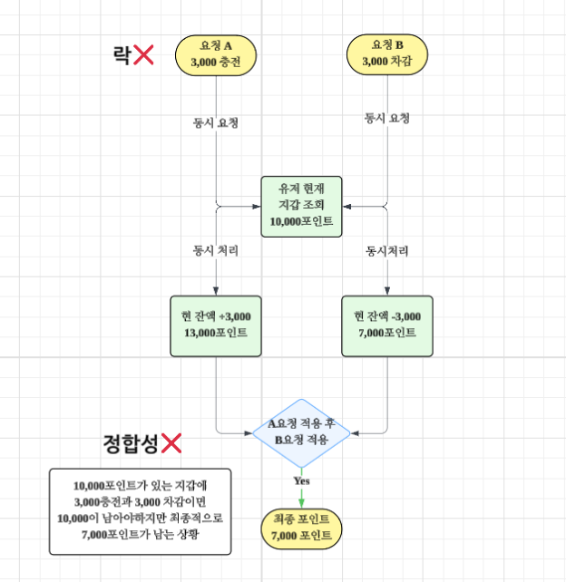
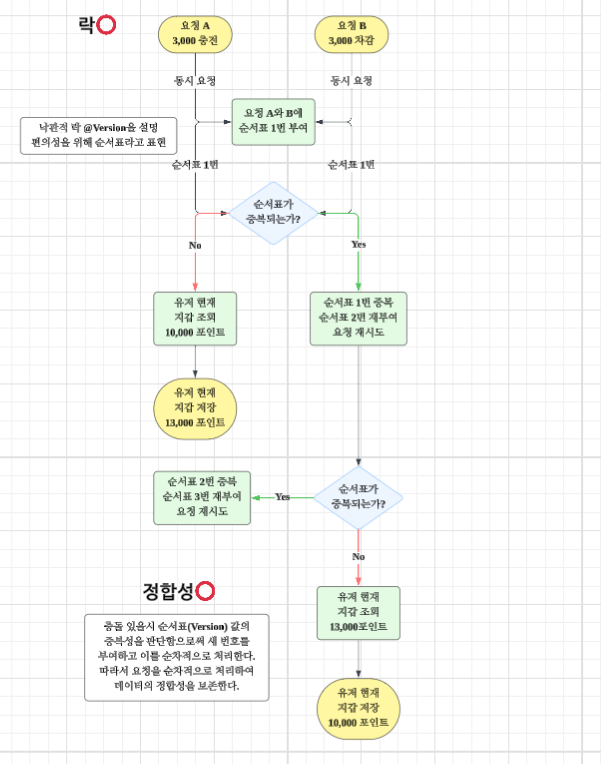

# 🏦 PointWallet 낙관적 락(Optimistic Lock) 도입 결정

### 🧐 문제 정의

* **동시 갱신 가능성**: 충전/출금/경매정산/즉시판매 등 다양한 경로로 동일 사용자의 지갑이 동시에 갱신될 가능성이 존재합니다.
* **데이터 정합성**: 락 없이 처리할 경우 'Lost Update'가 발생하여 잔액 불일치가 일어날 수 있습니다.
* **최우선 가치**: 포인트는 금전 데이터이므로 동시성 환경에서의 **'정합성'** 확보가 최우선 과제였습니다.

---

### 📜 해결 방안 비교 및 검토

| 방식 | 장점 | 단점 | 선택 여부 |
| :--- | :--- | :--- | :---: |
| **락 없이 업데이트** | 구현이 매우 간단함 | Lost Update로 인한 재무 정합성 파괴 | ❌ |
| **비관적 락 (Pessimistic)** | 정합성 보장이 강력함 | 락 대기/데드락/DB 부하 및 병목 리스크 | ❌ |
| **낙관적 락 (Optimistic)** | **성능/확장성에 유리** | 충돌 발생 시 별도의 재시도 로직 필요 | ✅ |

---

### ✏️ 해결 과정 (의사결정 이유)

1.  **실제 충돌 확률 분석**
    * 충돌 가능성은 존재하지만, 동일 사용자의 지갑 업데이트가 매 초마다 수십 건씩 경쟁하는 구조는 아니라고 판단했습니다.
2.  **비관적 락의 운영 비용 고려**
    * 비관적 락은 정합성은 강하지만 락 대기 시간 증가로 인한 응답 지연, DB 커넥션 점유 등의 병목 현상이 생기기 쉽습니다.
3.  **낙관적 락의 효율성**
    * '충돌이 발생한 경우에만' 비용을 지불하는 구조입니다. 평상시에는 락 대기 없이 빠르게 처리하고, 충돌 시에만 `OptimisticLockException`을 통해 정합성을 확보합니다.
4.  **확장성 설계**
    * 우선 낙관적 락으로 성능과 정합성을 모두 챙기되, 향후 트래픽 패턴 변화에 따라 비관적 락으로 전환이 용이하도록 추상화된 구조로 설계하였습니다.

---

### 📌 해결 내용 (Implementation)

* **@Version 적용**: Wallet 엔티티에 버전 관리 필드를 추가하여 JPA 레벨에서 낙관적 락을 활성화했습니다.
* **예외 핸들링**: 업데이트 충돌 시 발생되는 예외를 감지하여 **"중복 차감/중복 적립"**을 원천 차단했습니다.
* **재시도 정책**: 충돌을 정상적인 경쟁 상태로 간주하고, 짧은 재시도 정책(2~3회)을 적용할 수 있도록 로직을 구성했습니다.

---

### 📝 회고록

#### 배운 점
* 금전 데이터는 **"빠르게 처리"**보다 **"절대 틀리지 않게 처리"**하는 것이 본질임을 다시 한번 깨달았습니다.
* 낙관적 락은 무조건적인 성능 향상이 목적이 아니라, 충돌 빈도가 낮은 환경에서 정합성을 유지하며 자원을 효율적으로 사용하는 전략임을 학습했습니다.

#### 성과
* 동일 사용자 지갑에 대한 동시 요청 시 데이터 오염 방지 및 정합성 확보
* 불필요한 DB 락 대기 시간을 제거하여 시스템 전반의 처리량(Throughput) 유지

#### 추가 개선 가능한 부분
* 재시도 횟수를 초과하는 극심한 충돌 상황에 대한 모니터링 및 알림 체계 구축
* 충돌이 잦은 특정 유저/상황 발생 시 동적으로 락 전략을 변경하는 로직 검토