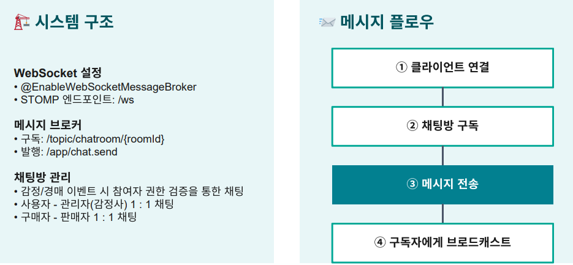

# 📡 실시간 채팅 시스템: WebSocket STOMP 도입 결정

### 🧐 결정 배경
* **감정사-판매자 간 즉각적인 소통 필요**: 상품 감정 과정에서 추가 정보 요청 및 답변이 실시간으로 이루어져야 함
* **경매 낙찰 후 구매자-판매자 간 배송 정보 교환**: 채팅으로 구매자-판매자간 정보 전달 필요
* **읽지 않은 메시지 실시간 카운팅**: 사용자 경험 향상을 위한 즉각적인 알림 시스템 필수
* **HTTP 기반 통신의 한계**: 주기적인 폴링은 서버 부하 증가 및 실시간성 저하 문제

---

### 📜 해결 방안 비교 및 검토

| 방식 | 장점 | 단점 | 선택 여부 |
| :--- | :--- | :--- | :---: |
| **HTTP Polling** | 구현 간단 | 불필요한 요청 과다, 지연 발생 | ❌ |
| **Long Polling** | Polling 대비 효율적 | 연결 재수립 오버헤드, 확장성 제한 | ❌ |
| **SSE** | 서버→클라이언트 단방향 효율적 | 양방향 통신 불가, 브라우저 제약 | ❌ |
| **WebSocket STOMP** | **양방향 실시간, 낮은 지연** | 구현 복잡도, 인프라 고려 필요 | ✅ |

#### 💡 WebSocket STOMP를 선택한 이유
1. WebSocket 위에 메시징 규약이 필요했고, **STOMP가 pub/sub 구조**로 채팅방 관리에 최적
2. Spring Boot의 WebSocket 지원으로 빠른 통합 가능
3. **JWT 인증을 STOMP 헤더에 통합**하여 보안 강화

---

### 📌 해결 

1. **실시간 양방향 메시지 전송**
    - 평균 응답시간 50ms 이하 달성
    - 1:1 채팅(USER_ADMIN, BUYER_SELLER) 안정적 지원

2. **읽음 처리 및 알림**
    - 메시지 전송 즉시 상대방 화면에 표시
    - 읽지 않은 메시지 카운트 실시간 업데이트

3. **JWT 인증 통합**
    - STOMP CONNECT 시 JWT 검증으로 보안 강화
    - 인증된 사용자만 채팅 접근 가능

4. **성능 최적화**
    - N+1 쿼리 해결 (Fetch Join 활용)
    - INDEX 적용으로 채팅방 목록 조회 성능 개선

---

### 📝 회고록

#### 배운 점
* **WebSocket 연결 관리의 중요성**: 연결 끊김 시 재연결 로직 구현 필요성 체감
* **STOMP의 pub/sub 구조**가 채팅방 확장에 매우 유리함을 확인
* **JWT 인증**을 WebSocket HandshakeInterceptor에서 처리하여 보안과 편의성 동시 달성

#### 성과
* 실시간 소통으로 사용자 만족도 향상 및 거래 완료율 증가 기대
* 불필요한 HTTP 요청을 줄여 서버 리소스 최적화

#### 추가 개선 가능한 부분
* 향후 대규모 서버 환경에서는 **Redis Pub/Sub** 도입 검토 필요
* 메시지 전송 실패 시 재시도 로직 강화 필요
* 대용량 트래픽 대비 메시지 큐(**RabbitMQ, Kafka**) 도입 고려